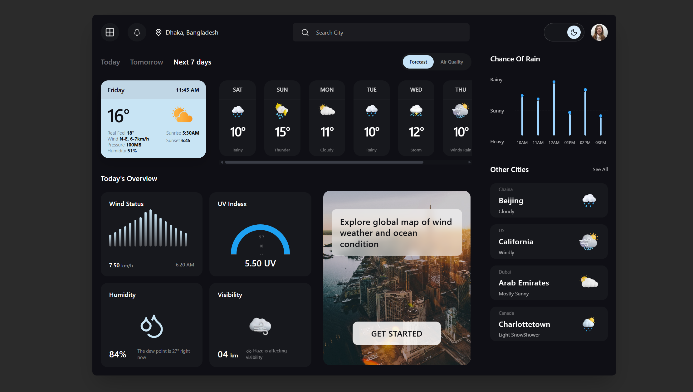

# Weather Dashboard

A modern dark-themed weather dashboard UI built with **Next.js**, **TypeScript**, and **Tailwind CSS**.

This project was developed from a Figma design with a focus on clean component structure, reusable static data, Figma-exported assets, smooth animations, and desktop UI accuracy.

## Preview



The dashboard includes a complete desktop weather interface with:

- Navbar with location, search input, theme toggle, and avatar
- Today / Tomorrow / Next 7 days navigation
- Forecast / Air Quality toggle
- Current weather card
- Scrollable weekly forecast cards
- Today's overview cards
- Wind Status chart
- UV Index gauge
- Humidity and Visibility cards
- Map banner section
- Chance of Rain chart
- Other Cities list

## Tech Stack

- **Next.js**
- **TypeScript**
- **Tailwind CSS**
- **Framer Motion**
- **Lucide React**
- **Static mock data**
- **Figma-exported assets**

## Features

### Figma-Based UI

The layout was implemented based on a provided Figma design. The interface follows a modern dark dashboard style with rounded cards, custom spacing, weather illustrations, and chart-like UI elements.

### Component-Based Architecture

Each major UI block is separated into its own component folder. This keeps the project easier to read, maintain, and extend.

```txt
src/components/
  navbar/
  tabs/
  today-weather-card/
  weekly-forecast/
  overview/
  right-panel/
  weather-icon/
```

Each component keeps its Tailwind classes in a separate style file, making the JSX cleaner and easier to understand.

Example:

```txt
weekly-forecast/
  WeeklyForecast.tsx
  weeklyForecast.styles.ts
  index.ts
```

### Static Mock Data

All hardcoded weather data is stored in:

```txt
src/lib/mockData.js
```

This makes the UI ready for future API integration. When real weather API data is added later, the component structure can stay mostly unchanged.

### Figma Assets

Weather icons and banner images are stored inside the `public` folder and rendered through reusable components.

```txt
public/
  icons/
  images/
```

### Scrollable Weekly Forecast

The weekly forecast section supports all week days and uses horizontal scrolling when the cards exceed the available width.

### Animations

Framer Motion is used for smooth entrance animations, hover effects, and small UI transitions.

## Project Structure

```txt
weather-dashboard/
  public/
    icons/
    images/

  src/
    app/
      globals.css
      layout.tsx
      page.tsx

    components/
      navbar/
      tabs/
      today-weather-card/
      weekly-forecast/
      overview/
      right-panel/
      weather-icon/
      Dashboard.tsx

    lib/
      mockData.js
```

## Getting Started

Clone the repository:

```bash
git clone https://github.com/vahid2104/weather-dashboard.git
```

Navigate to the project folder:

```bash
cd weather-dashboard
```

Install dependencies:

```bash
npm install
```

Run the development server:

```bash
npm run dev
```

Open the project in your browser:

```txt
http://localhost:3000
```

## Available Scripts

Run the development server:

```bash
npm run dev
```

Build the app for production:

```bash
npm run build
```

Start the production server:

```bash
npm run start
```

Run linting checks:

```bash
npm run lint
```

## Future Improvements

- Connect a real weather API
- Add city search functionality
- Add real dark/light mode switching
- Make the layout responsive for tablet and mobile
- Add loading and error states
- Improve chart accuracy with real data
- Add unit tests for reusable components

## Author

**Vahid Aliyev**

- GitHub: [vahid2104](https://github.com/vahid2104)
